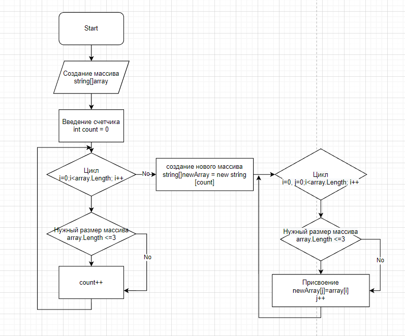

# Итоговая работа
## Алгоритмическая задача

1. Создать репозиторий на GitHub

2. Нарисовать блок-схему алгоритма (можно обойтись блок-схемой основной содержательной части, если вы выделяете её в отдельный метод)
3. Снабдить репозиторий оформленным текстовым описанием решения (файл README.md)

4. Написать программу, решающую поставленную задачу

5. Использовать контроль версий в работе над этим небольшим проектом (не должно быть так, что всё залито одним коммитом, как минимум этапы 2, 3, и 4 должны быть расположены в разных коммитах)

_Задача_  :Написать программу, которая из имеющегося массива строк формирует новый массив из строк, длина которых меньше, либо равна 3 символам. Первоначальный массив можно ввести с клавиатуры, либо задать на старте выполнения алгоритма. При решении не рекомендуется пользоваться коллекциями, лучше обойтись исключительно массивами.

## Решение
## 1. Создал репозиторий (https://github.com/Vineker1One/Finalproject)

## 2. Cоздал блок-схему

## 3. Создал первый метод с одномерным массивом. Далее создал метод, который находит элементы, длина которых <= 3.

    1. Создание счетчика (count) для того, чтобы узнать длину нового массива
    2. Создание цикла (for) (int i = 0; i < array.Length; i++)
    3. Условием if (array[i].Length <= 3) тогда count++ находим размер второго массива
    4. Создание нового массива с найденным размером
    5. Новый цикл (for) (int i = 0, j = 0; i < array.Length; i++)
    6. Условие if (array[i].Length <= 3) тогда newArray[j] = array[i]
    7. После завершения цикла вывести массив

## 4. Написание программы, решающую эту задачу (https://github.com/Vineker1One/Finalproject/blob/main/Final%20Project/kod/Program.cs)

## 5. Сделал достаточное количество комментариев